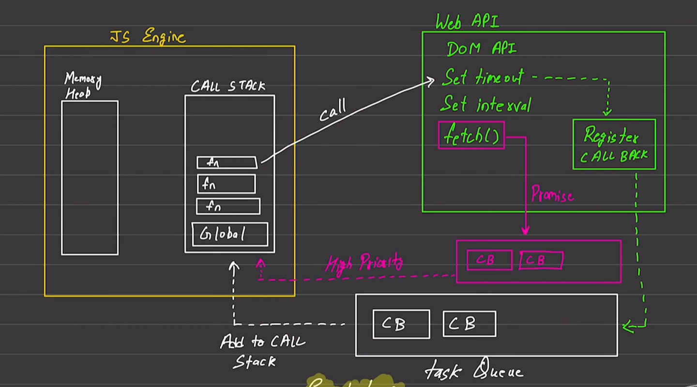

//async

//javascript default behaviour-----synchronous & single threaded.

//Execution context
1.execution one line of code at a time.
2.each operation waits for the last one to complete before executing.

//blocking code--
--block the flow of program
--read file sync.

//Non blocking code
--does not block execution
--read file async

